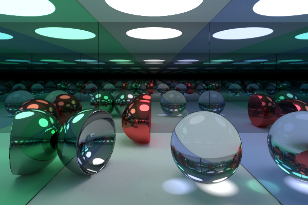
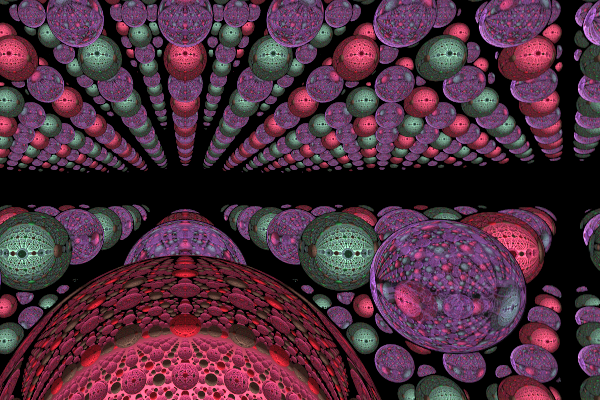
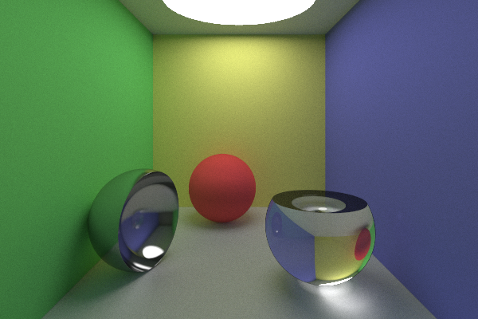

# Raymarcher

This is a renderer in [Futhark](futhark-lang.org), using raymarching for scene intersections and path tracing reflected/refracted rays to calculate lighting.

## Running

This project is developed with [Liveshader](https://github.com/Vizaxo/liveshader-futhark) to produce images.

## Sceenshots

